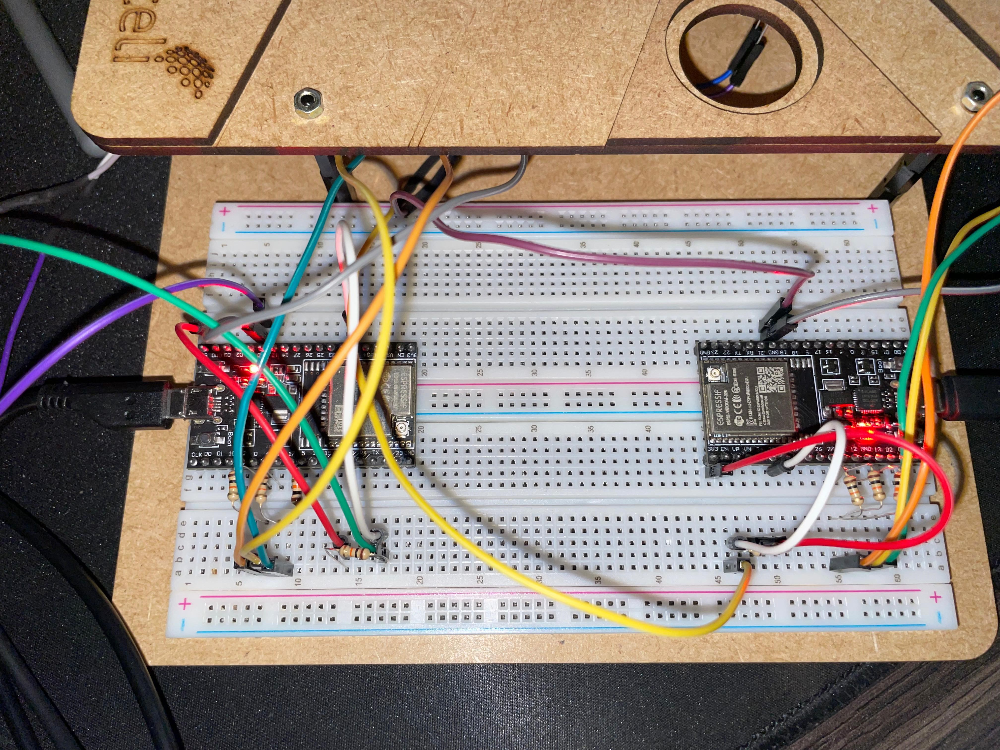
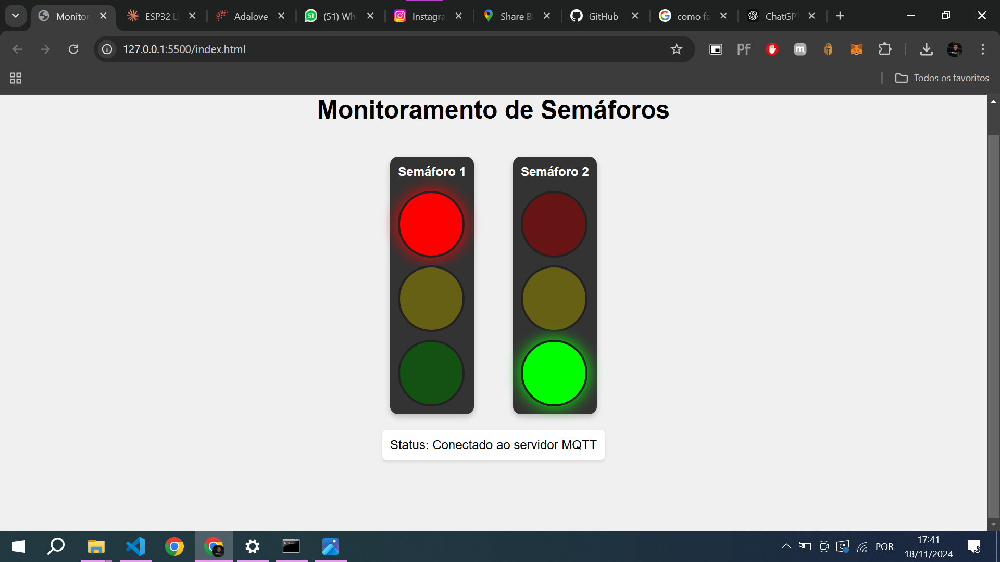

# Sistema de Semáforos Sincronizados via MQTT

## Sumário
1. [Visão Geral](#visão-geral)
2. [Componentes do Sistema](#componentes-do-sistema)
3. [Arquitetura](#arquitetura)
4. [Hardware Necessário](#hardware-necessário)
5. [Configuração do Ambiente](#configuração-do-ambiente)
6. [Implementação](#implementação)
7. [Interface Web](#interface-web)
8. [Protocolo de Comunicação](#protocolo-de-comunicação)

---

## Vídeo Demonstração Semáforo
[Clique aqui para assistir ao vídeo de demonstração dos semáforos em funcionamento.](assets/demo.mp4)

---

## Video demonstração LDR
[Clique aqui para assistir ao vídeo de demonstração do LDR em funcionamento.](assets/ldr.mp4)

Aqui é possível observar o funcionamento do LDR. Quando ocorre a diminuição da luminosidade — ao tamparmos o sensor LDR com o dedo — o ciclo dos semáforos é interrompido, estabilizando o semáforo do sensor na cor verde e o outro na cor vermelha.

---

## Video demonstração Modo Noturno
[Clique aqui para assistir ao vídeo de demonstração do Modo Noturno.](assets/modo_noturno.mp4)

Este vídeo apresenta a simulação do modo noturno. Esse modo foi desenvolvido após a entrega da maquete, portanto, o vídeo é apenas uma simulação. Um botão na interface publica, em um tópico MQTT, a ativação desse modo, fazendo com que ambos os semáforos pisquem em amarelo.

---

## Circuito

<p align="center">
  
</p>

---

## Interface de Controle

<p align="center">
  
</p>

---

## Visão Geral

O sistema consiste em dois semáforos sincronizados através do protocolo MQTT, utilizando ESP32s como controladores e uma interface web para monitoramento em tempo real. O sistema opera em uma configuração mestre-escravo, onde um semáforo controla o timing e o outro responde aos sinais recebidos.

### Características Principais
- Comunicação segura via MQTT sobre WSS
- Sincronização automática entre semáforos
- Interface web para monitoramento
- Certificação SSL para conexões seguras
- Sistema de fallback em caso de falha de comunicação

## Componentes do Sistema

### Hardware
- 2× ESP32 Development Boards
- 6× LEDs (2 vermelhos, 2 amarelos, 2 verdes)
- Resistores apropriados para os LEDs
- Fonte de alimentação 5V

### Software
- Arduino IDE
- Bibliotecas:
  - WiFi.h
  - PubSubClient.h
  - WiFiClientSecure.h
- Broker MQTT: HiveMQ Cloud
- Interface Web HTML/CSS/JavaScript

## Arquitetura

O sistema segue uma arquitetura distribuída com os seguintes componentes:

```
[Semáforo 1 (Master)] → [MQTT Broker] → [Semáforo 2 (Slave)]
            ↑                  ↑               ↑
            └──────────[Interface Web]─────────┘
```

### Fluxo de Dados
1. O semáforo master controla o timing e publica estados
2. O broker MQTT distribui as mensagens
3. O semáforo slave recebe e reage às mensagens
4. A interface web monitora e exibe os estados em tempo real

## Hardware Necessário

### Conexões do ESP32 (Semáforo 1)
- LED Vermelho: GPIO 27
- LED Amarelo: GPIO 14
- LED Verde: GPIO 12

### Conexões do ESP32 (Semáforo 2)
- LED Vermelho: GPIO 4
- LED Amarelo: GPIO 16
- LED Verde: GPIO 17

## Configuração do Ambiente

### 1. Configuração do HiveMQ Cloud
```cpp
const char* mqtt_server = "c4bd3577289c4b58a61f581b8260c62c.s1.eu.hivemq.cloud";
const int mqtt_port = 8883;
const char* mqtt_username = "jonathan";
const char* mqtt_password = "Atlas.2267";
```

### 2. Configuração Wi-Fi
```cpp
const char* ssid = "esp32";
const char* password = "jonathan123";
```

### 3. Tópicos MQTT
```cpp
const char* mqtt_topic_sync = "traffic_light_sync";
```

## Implementação

### Estados do Semáforo
```cpp
enum TrafficState { RED, GREEN, YELLOW };
```

### Tempos de Estado (Semáforo Master)
```cpp
const unsigned long RED_DURATION = 5000;    // 5 segundos
const unsigned long GREEN_DURATION = 5000;  // 5 segundos
const unsigned long YELLOW_DURATION = 2000; // 2 segundos
```

## Interface Web

A interface web fornece uma visualização em tempo real dos estados dos semáforos. Principais características:

- Design responsivo
- Atualização em tempo real via MQTT over WebSocket
- Indicadores visuais com efeitos de iluminação
- Status de conexão com o broker

## Protocolo de Comunicação

### Mensagens MQTT
- `"RED"`: Indica estado vermelho
- `"YELLOW"`: Indica estado amarelo
- `"GREEN"`: Indica estado verde

### Lógica de Sincronização
- Quando Semáforo 1 está Verde → Semáforo 2 está Vermelho
- Quando Semáforo 1 está Vermelho → Semáforo 2 está Verde
- Quando Semáforo 1 está Amarelo → Semáforo 2 está Amarelo


## Troubleshooting

### Problemas Comuns

1. **Falha na Conexão Wi-Fi**
   - Verificar credenciais SSID e senha
   - Confirmar alcance do sinal
   - Verificar alimentação do ESP32

2. **Falha na Conexão MQTT**
   - Verificar credenciais do broker
   - Confirmar validade do certificado
   - Verificar conectividade da rede

3. **Dessincronização dos Semáforos**
   - Reiniciar ambos os ESP32s
   - Verificar conexão com o broker
   - Confirmar recebimento das mensagens MQTT

### Logs e Depuração
O sistema utiliza a porta serial (115200 baud) para logs de depuração:
```cpp
Serial.begin(115200);
```

Para monitorar o funcionamento, conecte via monitor serial e observe as mensagens de status e debug.
